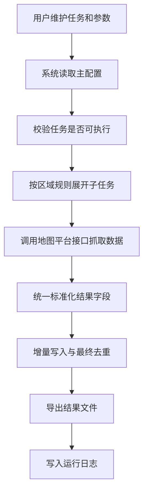
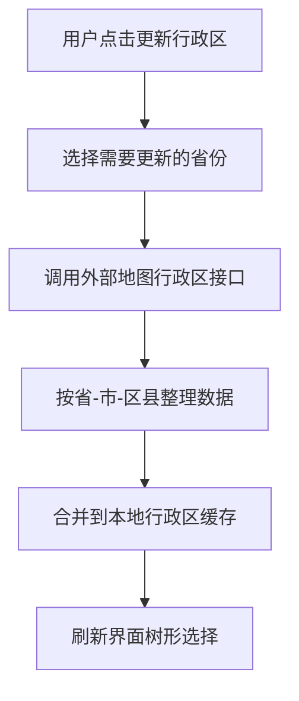
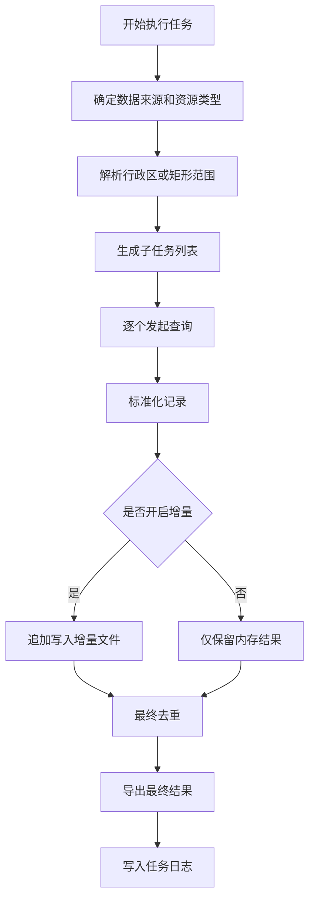

# POI 抓取工具软件设计说明

## 1. 文档说明

本文档用于说明 POI 抓取工具的业务定位、功能边界、运行流程、对外接口和输出结构，供日常使用、维护和后续扩展参考。

本文档不追求源码级展开，重点回答四个问题：

- 系统要解决什么问题
- 用户如何配置和执行任务
- 一次任务从输入到输出如何流转
- 系统最终产出哪些数据

## 2. 系统定位

本工具是一个面向地图兴趣点采集场景的任务化抓取系统。用户可以通过图形界面或命令行维护任务，按行政区或矩形范围批量抓取目标资源点，并将结果输出为结构化文件。

系统当前支持百度、高德、天地图三类地图数据来源，支持手动执行、批量执行和定时执行，支持增量输出、日志留痕和行政区缓存。

## 3. 设计目标

- 以单一配置驱动运行，降低维护成本
- 以任务为中心组织抓取参数，避免全局状态混乱
- 兼容多地图来源，但对上层保持统一使用方式
- 支持省、市、区县逐级展开，保证查询颗粒度可控
- 支持增量采集，避免重复导出相同数据
- 支持图形化操作，降低非开发人员使用门槛

## 4. 总体业务结构

系统由四部分组成：

- 配置中心：保存 API Key、任务列表、导出规则、调度规则
- 任务执行中心：负责展开区域、组织查询、汇总结果、导出文件
- 地图接入层：负责调用不同地图平台接口并归一化结果
- 本地存储层：保存配置、行政区缓存、运行日志、导出结果

整体原则如下：

- 运行时只读取主配置中的任务定义
- 行政区缓存只在用户明确更新时联网刷新
- 抓取结果先标准化，再进入去重和导出环节
- 最终输出与增量输出使用一致的字段定义

## 5. 核心功能

### 5.1 任务管理

系统支持维护多个抓取任务。每个任务至少包含以下内容：

- 任务名称
- 是否启用
- 数据来源
- 查询区域
- 资源类型
- 导出方式
- 调度设置

任务之间相互独立，便于按场景拆分，例如按行业拆分、按城市拆分、按时间拆分。

### 5.2 区域选择与展开

系统支持两类区域输入：

- 行政区模式：按省、市、区县组织查询
- 矩形范围模式：按经纬度边界组织查询

在行政区模式下，系统会根据用户选择自动展开任务：

- 选择整省时，展开到城市级
- 选择整市时，展开到区县级
- 选择具体区县时，直接执行

直辖市场景也按统一规则处理，最终仍落到实际可查询的区县子任务。

### 5.3 行政区缓存

系统使用本地行政区缓存支撑界面树形选择和运行时展开。缓存目标结构统一为：

```json
{
  "省": {
    "市": ["区县1", "区县2"]
  }
}
```

本轮设计确认两条约束：

- 点击“更新行政区”后，缓存会补齐到区县一级
- 在界面中展开城市节点时，如本地缓存尚无区县，也会同步写回缓存文件

这样可以保证“配置文件结构”和“界面树结构”一致，减少显示与运行不一致的问题。

### 5.4 抓取与结果标准化

不同地图平台返回的数据字段并不完全一致。系统会在抓取后统一整理为一套标准记录，再进入去重和导出阶段。

标准化后的结果至少包含：

- 来源平台
- 唯一标识
- 名称
- 地址
- 经纬度
- 类型
- 联系方式
- 所属任务
- 运行时间
- 省
- 市
- 区县

其中，省、市、区县字段属于本次设计的重要约束：

- 这三个字段在已知行政区任务中属于运行时已知条件
- 应在记录组装阶段统一补齐
- 最终导出文件和增量文件都必须包含这三个字段

### 5.5 去重与增量输出

系统支持增量采集。设计目标不是“全量历史库去重”，而是“在当前任务维度下避免重复输出”。

处理原则如下：

- 任务开始时读取当前增量文件中的已存在记录键
- 每个子任务完成后可追加写入增量文件
- 任务结束前再基于初始快照做最终去重

这样可以避免“本轮刚写入的记录又被重复判定为旧数据”导致结果被错误清空。

### 5.6 调度执行

系统支持定时检查任务是否到期，并自动执行到期任务。调度能力面向轻量级本地运行场景，适用于：

- 每日更新
- 间隔天数更新
- 固定任务集轮询执行

当前设计不包含分布式调度和跨进程恢复。

## 6. 业务流程

### 6.1 配置与执行主流程



### 6.2 行政区更新流程



### 6.3 单任务执行流程



## 7. 对外接口

### 7.1 用户接口

| 接口名称 | 形式 | 用途 | 主要输入 | 主要输出 |
| --- | --- | --- | --- | --- |
| 图形界面 | 桌面界面 | 维护任务、选择区域、执行任务、查看日志 | 主配置、用户操作 | 任务配置、执行结果、日志展示 |
| 单任务执行 | 命令行 | 执行指定任务 | 任务名、配置路径 | 导出文件、运行日志 |
| 批量执行 | 命令行 | 执行全部启用任务 | 配置路径 | 多个任务结果和日志 |
| 日志导出 | 命令行 | 导出运行日志供复盘 | 导出路径、配置路径 | 日志文件 |
| 更新行政区 | 图形界面按钮 | 刷新选定省份的行政区缓存 | 省份列表 | 最新行政区缓存、刷新后的地区树 |

### 7.2 配置与数据接口

| 接口名称 | 载体 | 用途 | 关键内容 | 读写方式 |
| --- | --- | --- | --- | --- |
| 主配置 | config/poi_config.json | 系统运行入口配置 | API Key、任务列表、导出规则、调度规则 | 读写 |
| 行政区缓存 | config/region_cache.json | 支撑地区树与行政区展开 | 省、市、区县层级数据 | 读写 |
| 运行日志 | logs/poi_fetcher_logs.jsonl | 记录任务执行结果 | 任务名、时间、状态、条数、说明 | 追加写 |
| 结果目录 | POI_Data/日期目录 | 存放导出文件 | 最终结果、增量结果 | 写入 |

### 7.3 外部依赖接口

| 接口名称 | 方向 | 用途 | 返回特点 | 设计要求 |
| --- | --- | --- | --- | --- |
| 百度地图 POI 接口 | 系统调用外部 | 获取 POI 数据 | 字段结构与其他平台不同 | 统一标准化后再输出 |
| 高德地图 POI 接口 | 系统调用外部 | 获取 POI 数据和行政区数据 | 一般能提供稳定 ID | 作为主要行政区更新来源 |
| 天地图 POI 接口 | 系统调用外部 | 获取 POI 数据 | 唯一 ID 可能缺失 | 允许标准记录中的 ID 为空 |

## 8. 配置说明

### 8.1 主配置设计

系统采用单一主配置文件运行。运行时重点读取以下内容：

- API Key
- 任务列表
- 默认分页与导出规则
- 是否启用增量
- 调度检查间隔

设计原则：

- 任务必须自行携带数据来源和资源类型
- 不再依赖已废弃的顶层任务字段
- 任务是最小执行单元，系统不在运行时隐式猜测任务参数

### 8.2 任务对象设计

一个任务建议至少包含以下信息：

- 名称
- 启用状态
- 数据来源
- 区域类型
- 行政区列表或矩形范围
- 资源类型列表
- 导出格式
- 调度设置

### 8.3 行政区缓存设计

缓存结构统一为“省 -> 市 -> 区县列表”，并遵循以下原则：

- 普通启动不自动联网刷新缓存
- 用户明确点击更新时才联网
- 展开城市节点时允许补抓区县并写回缓存
- 省市名称规范化后再写入，避免重复键

## 9. 输出设计

### 9.1 输出文件类型

系统支持以下输出形式：

- CSV
- JSON
- Excel

其中增量输出通常以 CSV 为主，用于后续持续采集和对比。

### 9.2 目录组织

结果按日期组织，便于区分每日批次。一个典型目录中可能包含：

- 最终结果文件
- 增量结果文件
- 不同任务或不同资源分类的输出文件

### 9.3 输出字段数据字典

| 字段名 | 含义 | 类型 | 是否必填 | 说明 |
| --- | --- | --- | --- | --- |
| source | 数据来源 | 字符串 | 是 | 百度、高德、天地图等 |
| id | 记录标识 | 字符串 | 否 | 由外部平台返回，部分平台可能为空 |
| name | 名称 | 字符串 | 是 | POI 名称 |
| address | 地址 | 字符串 | 否 | 平台返回的地址文本 |
| province | 省 | 字符串 | 行政区任务必填 | 运行时已知行政区信息 |
| city | 市 | 字符串 | 行政区任务必填 | 运行时已知行政区信息 |
| county | 区县 | 字符串 | 行政区任务必填 | 运行时已知行政区信息 |
| latitude | 纬度 | 数值/字符串 | 否 | 标准化后的纬度 |
| longitude | 经度 | 数值/字符串 | 否 | 标准化后的经度 |
| type | 类型 | 字符串 | 否 | 平台原始分类或归一化分类 |
| contact | 联系方式 | 字符串 | 否 | 电话或其他联系方式 |
| task | 所属任务 | 字符串 | 是 | 用于追踪数据来源任务 |
| run_time | 运行时间 | 字符串 | 是 | 本次任务执行时间 |

### 9.4 日志字段说明

运行日志用于记录任务结果，建议重点关注以下字段：

- task_name：任务名称
- run_time：运行时间
- area：执行区域
- status：执行状态
- records：结果条数
- mode：执行方式
- message：摘要说明
- subtask_attempts：子任务尝试次数
- subtask_success：子任务成功次数
- total_fetched：抓取原始总条数

## 10. 异常与控制策略

### 10.1 异常处理

- 配置缺失时，任务快速失败并返回明确提示
- 单个子任务失败时，尽量不影响其他子任务继续执行
- 导出失败时，保留日志信息便于复盘
- 外部平台字段缺失时，按标准化规则尽量兼容

### 10.2 请求控制

为降低外部接口压力，系统在执行时会进行请求节流控制。核心目标不是追求极限吞吐，而是保证：

- 请求节奏平稳
- 多任务执行不压垮外部平台
- 同一任务在较长时间运行时结果稳定可控

## 11. 测试关注点

当前设计建议重点验证以下场景：

- 行政区选择、保存、加载是否一致
- 整省、整市、具体区县三类任务能否正确展开
- 行政区缓存是否稳定保持到区县一级
- 最终输出和增量输出是否同时包含省、市、区县字段
- 增量去重是否会误删本轮新增记录
- 不同地图来源返回结构差异是否被正确兼容

## 12. 已知边界

- 当前设计以本地文件持久化为主，不依赖数据库
- 当前调度能力适合单机轻量运行，不适合分布式调度
- 不同地图平台字段完整度不同，标准化后仍可能存在少量缺省值
- 天地图场景下唯一标识不一定稳定存在，应允许业务侧按名称、地址和坐标综合判断

## 13. 版本基线

- 文档日期：2026-05-06
- 当前基线：单一主配置驱动、行政区缓存统一到区县层、导出结果补齐省市区字段
