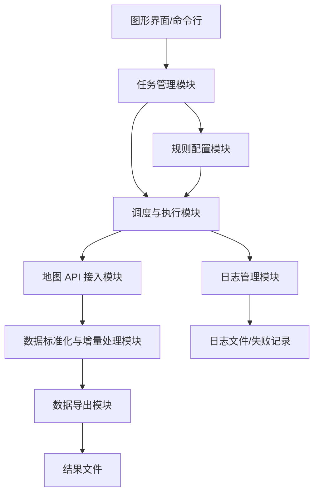
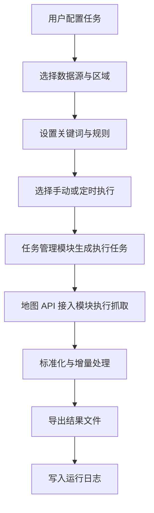
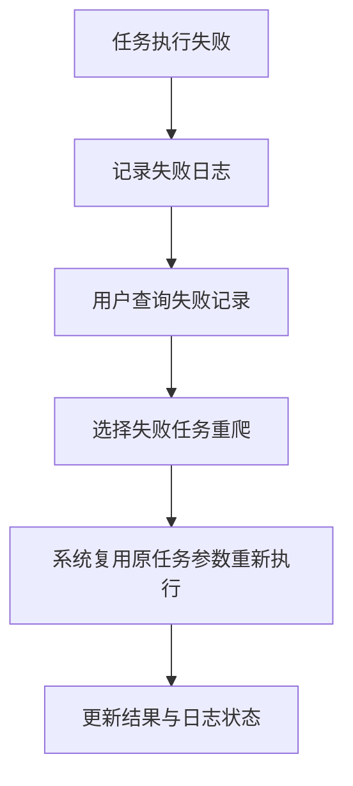

# POI 抓取工具软件设计说明

## 1. 文档说明

本文档用于说明 POI 抓取工具的软件功能、总体架构、模块边界、接口设计、业务流程、配置方式、输出结果与日志设计，供产品确认、开发实现、测试验证和后续维护参考。

本文档重点说明以下内容：

- 软件支持哪些核心功能
- 各功能模块如何分工协作
- 用户如何配置和执行爬取任务
- 系统如何组织规则、输出数据和日志
- 软件运行后的主要产出是什么

## 2. 软件定位

POI 抓取工具是一套面向地图兴趣点采集场景的桌面端任务执行软件。系统通过统一配置接入主流地图 API，支持用户按城市、行政区域、坐标范围和关键词建立爬取任务，并通过手动执行或定时触发方式批量采集 POI 数据。

系统支持百度、高德、天地图等主流地图数据来源，能够将不同来源返回的数据整理为统一格式，并输出为 Excel、CSV、JSON 等文件，满足离线导入、数据分析、数据补录和周期更新等场景使用需求。

## 3. 设计目标

- 支持主流地图 API 的统一接入与统一调用
- 支持以任务方式维护爬取配置，便于重复执行和集中管理
- 支持按行政区域、坐标范围和关键词灵活定义爬取规则
- 支持手动与定时两类任务执行方式
- 支持全量爬取和增量爬取两类数据采集模式
- 支持统一格式的数据导出与离线导入适配
- 支持完整的运行日志记录、查询、导出和失败重爬

## 4. 总体架构设计

### 4.1 架构组成

系统总体上由以下几类模块组成：

- 表现层：图形界面与命令行入口，负责任务配置、执行触发和结果展示
- 任务管理层：负责任务定义、保存、加载、启停和调度控制
- 规则处理层：负责区域规则、频率规则和爬取模式控制
- 数据采集层：负责调用各地图平台 API 并获取原始 POI 数据
- 数据处理层：负责结果标准化、增量判断、去重和导出组织
- 日志与存储层：负责配置持久化、日志记录、失败任务留痕和结果文件存储

### 4.2 架构关系

系统采用“配置驱动、任务执行、结果输出、日志留痕”的分层运行方式。上层通过界面或命令行录入任务，中间层根据规则拆解并执行任务，下层负责数据抓取、结果处理与文件输出。

### 4.3 设计原则

- 任务配置与任务执行分离，避免界面逻辑与运行逻辑耦合
- 地图 API 接入统一封装，屏蔽不同平台字段差异
- 规则配置集中管理，确保同一任务具备明确、可复用的执行口径
- 数据导出与日志记录独立处理，便于后续扩展和维护

## 5. 模块设计

### 5.1 爬虫任务管理模块

爬虫任务管理模块负责维护、执行和调度 POI 采集任务，是系统的核心入口。

#### 5.1.1 功能目标

- 支持配置主流地图 API 及其访问参数
- 支持按城市、行政区域、关键词定义爬取任务
- 支持任务的新增、编辑、启用、停用和删除
- 支持手动执行任务和定时触发任务
- 支持一个系统内维护多个独立任务

#### 5.1.2 任务配置内容

每个任务至少包含以下信息：

- 任务名称
- 是否启用
- 数据来源
- 爬取区域
- 关键词或资源类型
- 爬取方式
- 导出格式
- 调度设置
- 增量或全量模式

#### 5.1.3 任务执行方式

系统支持两种任务执行方式：

- 手动执行：由用户在图形界面或命令行主动触发任务
- 定时执行：由系统按照预设时间或周期自动触发任务

#### 5.1.4 任务结果内容

任务执行后，系统返回的 POI 点信息应至少包含以下基础属性：

- 点位名称
- 地理坐标
- POI 类型
- 地址信息
- 联系方式
- 所属区域
- 数据来源
- 爬取时间

#### 5.1.5 模块接口

任务管理模块对外提供以下能力：

- 创建任务
- 保存任务
- 加载任务
- 启用或停用任务
- 手动执行任务
- 获取待执行任务列表

### 5.2 爬取规则配置模块

爬取规则配置用于控制任务的采集范围、执行频率和爬取策略。

#### 5.2.1 区域规则配置

系统支持两类区域配置方式：

- 按行政区域配置：按省、市、区县组织爬取范围
- 按坐标范围配置：按矩形边界或坐标范围组织爬取范围

在行政区域模式下，系统应支持按城市或区县进一步细化任务，避免单次查询范围过大导致结果不完整。

#### 5.2.2 频率规则配置

系统支持两类执行频率：

- 手动执行
- 定时执行

定时执行应支持配置执行时间、执行周期或间隔天数，满足日常巡检、周期更新和定期补采场景。

#### 5.2.3 输出字段口径

当前软件不提供“自由配置输出字段列表”的能力。输出字段由系统按统一口径生成，默认包含名称、坐标、类型、地址、联系方式等基础字段，并附加区域信息、数据源、爬取时间等运行元数据。

#### 5.2.4 爬取模式配置

系统支持以下两种爬取模式：

- 全量爬取：按当前规则重新抓取完整结果集
- 增量爬取：在已有结果基础上，仅输出新增或更新的数据

增量爬取用于降低重复输出和重复整理成本；全量爬取用于首次采集、完整复核或历史数据重建。

#### 5.2.5 模块接口

规则配置模块对外提供以下能力：

- 设置区域规则
- 设置关键词规则
- 设置执行频率
- 设置增量或全量模式
- 获取任务规则明细

### 5.3 数据导出模块

数据导出模块负责将爬取结果整理为可交付、可导入、可复用的离线文件。

#### 5.3.1 导出目标

- 支持结果文件离线保存
- 支持导入其他业务系统或数据平台
- 支持人工查看、表格整理和后续分析

#### 5.3.2 导出格式

系统支持以下导出格式：

- Excel
- CSV
- JSON

不同格式可根据使用场景选择：

- Excel：适合人工查看、筛选和汇报整理
- CSV：适合批量处理、离线导入和增量比对
- JSON：适合程序调用和结构化数据交换

#### 5.3.3 导出内容

导出的数据文件除 POI 基础属性外，还应附加元数据，至少包括：

- 爬取时间
- 数据来源
- 任务名称
- 区域信息
- 导出时间或运行批次标识

#### 5.3.4 模块接口

数据导出模块对外提供以下能力：

- 导出 Excel
- 导出 CSV
- 导出 JSON
- 生成增量结果文件
- 生成全量结果文件

### 5.4 爬取日志管理模块

爬取日志管理模块负责记录任务执行过程、结果状态和异常信息，为任务追踪、问题定位和失败重爬提供支撑。

#### 5.4.1 日志记录内容

系统至少记录以下日志信息：

- 爬取时间
- 爬取区域
- 数据量
- 爬取状态
- 数据来源
- 任务名称
- 执行方式
- 异常说明

其中，爬取状态至少应支持：

- 成功
- 失败
- 部分成功

#### 5.4.2 日志功能要求

- 支持日志查询
- 支持日志导出
- 支持按任务、时间、区域和状态筛选日志
- 支持根据失败日志重新发起重爬

#### 5.4.3 失败重爬设计

当任务执行失败时，系统应保留失败任务的关键上下文，包括任务名称、区域、关键词、失败时间和失败原因。用户可基于失败记录重新触发重爬，无需重新手工录入完整任务参数。

#### 5.4.4 模块接口

日志管理模块对外提供以下能力：

- 写入执行日志
- 查询日志
- 导出日志
- 获取失败任务记录
- 基于失败记录触发重爬

### 5.5 地图 API 接入模块

地图 API 接入模块负责对接不同地图平台，完成 POI 查询请求发送、结果接收与基础响应转换。

#### 5.5.1 设计要求

- 支持接入百度、高德、天地图等主流地图 API
- 对上层屏蔽不同平台请求参数和返回结构差异
- 统一向上层返回标准化前的原始采集结果

#### 5.5.2 模块接口

- 调用百度 POI 查询
- 调用高德 POI 查询
- 调用天地图 POI 查询
- 获取行政区数据

### 5.6 数据标准化与增量处理模块

该模块负责将不同地图平台的原始结果整理为统一结构，并根据增量或全量模式进行结果处理。

#### 5.6.1 标准结果字段

标准结果至少包括：

- 名称
- 坐标
- 类型
- 地址
- 联系方式
- 数据来源
- 任务名称
- 省
- 市
- 区县
- 爬取时间

#### 5.6.2 模块接口

- 标准化结果字段
- 执行增量比对
- 执行全量结果整理
- 去重处理

## 6. 模块关系设计

各模块之间的关系如下：

- 任务管理模块依赖规则配置模块获取任务执行参数
- 调度执行能力依赖任务管理模块筛选待执行任务
- 地图 API 接入模块接收任务与规则参数并执行实际抓取
- 数据标准化与增量处理模块接收原始结果并生成标准数据集
- 数据导出模块对标准数据集进行结果文件输出
- 日志管理模块贯穿任务执行全流程，记录状态与失败信息

这表明系统采用“任务驱动执行、数据处理独立、日志全程记录”的组织方式。

## 7. 接口设计

### 7.1 用户接口

系统对用户提供以下入口：

- 图形界面：用于配置任务、执行任务、查看结果和日志
- 命令行：用于单任务执行、批量执行和日志导出

### 7.2 内部模块接口

系统内部模块接口可抽象为以下几类：

- 任务接口：创建、保存、加载、执行任务
- 规则接口：读取和更新区域、频率与爬取模式规则
- 采集接口：按数据源执行 POI 查询和行政区查询
- 导出接口：将标准结果输出为 Excel、CSV、JSON
- 日志接口：记录、查询、导出日志以及发起失败重爬

### 7.3 外部接口

系统外部依赖主要为地图平台提供的 API 接口，包括：

- 百度地图 POI 查询接口
- 高德地图 POI 查询接口
- 天地图 POI 查询接口
- 高德或其他平台提供的行政区接口

## 8. 数据结构设计

### 8.1 任务数据结构

任务是系统运行的最小管理单元，建议至少包含以下字段：

- task_name：任务名称
- enabled：是否启用
- provider：数据来源
- area_type：区域类型
- admin_regions 或 bounds：行政区列表或坐标范围
- keywords 或 resources：关键词或资源类型
- run_mode：手动或定时执行方式
- schedule：定时规则
- crawl_mode：全量或增量模式
- export_format：导出格式

该结构用于支撑任务保存、任务加载、任务调度和失败重爬时的参数复用。

### 8.2 规则数据结构

规则数据结构用于描述区域、频率和爬取模式，建议包含以下信息：

- 区域规则：省、市、区县或矩形范围
- 关键词规则：关键词列表、资源类型列表
- 频率规则：执行时间、周期、间隔天数
- 模式规则：增量或全量
- 数据来源：地图厂商

规则数据结构应与任务对象关联，并在任务执行时作为唯一规则来源。

### 8.3 POI 结果数据结构

POI 标准结果对象建议至少包含以下字段：

- source：数据来源
- id：平台记录标识
- name：点位名称
- longitude：经度
- latitude：纬度
- type：POI 类型
- address：地址
- contact：联系方式
- province：省
- city：市
- county：区县
- task_name：所属任务
- crawl_time：爬取时间

该结构用于统一承接各地图平台返回结果，并作为导出和日志统计的基础结构。

### 8.4 日志数据结构

日志对象建议至少包含以下字段：

- task_name：任务名称
- provider：数据来源
- crawl_time：执行时间
- area：爬取区域
- status：执行状态
- record_count：数据量
- run_mode：执行方式
- message：摘要说明
- retryable：是否支持重爬

失败日志还应补充失败原因、失败子任务和重爬上下文。

## 9. 配置文件设计

### 9.1 主配置文件设计

系统采用单一主配置文件作为运行入口，主要保存以下内容：

- 地图 API Key
- 任务列表
- 默认导出格式
- 调度相关参数
- 增量控制相关参数

设计要求如下：

- 主配置文件应可读、可写、可持久化
- 任务加载后应能够完整恢复任务与规则配置
- 配置项命名应清晰稳定，避免出现多套同义字段

### 9.2 行政区缓存文件设计

行政区缓存文件用于支撑区域树选择和行政区任务展开。缓存建议按“省 -> 市 -> 区县列表”的层级组织。

设计要求如下：

- 缓存文件支持本地长期保存
- 用户点击更新行政区时可刷新缓存内容
- 缓存内容应与界面树结构和任务展开逻辑保持一致

### 9.3 日志文件设计

日志文件用于保存任务执行历史，建议支持逐条追加写入。

设计要求如下：

- 每次任务执行产生独立日志记录
- 日志文件支持后续查询、筛选和导出
- 失败日志可直接支撑失败任务重爬

### 9.4 结果目录设计

结果文件建议按日期、任务或数据来源分类组织，便于后续查找和离线导入。

设计要求如下：

- 最终结果与增量结果可区分存放
- 同一批次结果具备明确命名规则
- 目录结构应便于人工查看和程序批量读取

## 10. 异常处理设计

### 10.1 异常分类

系统运行过程中主要可能出现以下异常：

- 配置异常：配置缺失、格式错误、任务参数不完整
- 接口异常：地图 API 调用失败、返回异常、限流或超时
- 数据异常：字段缺失、坐标缺失、类型不一致
- 导出异常：文件写入失败、路径无效、格式转换失败
- 调度异常：任务到期判断异常、任务执行冲突

### 10.2 异常处理原则

- 配置异常应在任务执行前尽早拦截
- 单个子任务失败时，尽量不影响其他子任务继续执行
- 外部接口异常应记录完整上下文，便于定位问题
- 导出异常应保留运行日志并提示用户
- 对支持重试或重爬的异常，应尽量保留原始任务参数

### 10.3 失败重爬处理

对于接口失败、部分区域失败或临时网络异常导致的任务失败，系统应支持基于失败记录重新执行，避免用户重新配置整个任务。

### 10.4 用户提示与日志联动

异常发生时，系统应同时完成两类处理：

- 向用户返回明确的状态提示
- 向日志模块写入详细异常信息

从而保证界面可感知、后台可追溯、失败可重爬。

## 11. 主要业务流程

### 11.1 任务配置与执行流程

### 11.2 失败重爬流程

## 12. 输入与输出设计

### 12.1 输入内容

系统运行主要依赖以下输入：

- 地图 API 配置
- 任务配置
- 区域配置
- 关键词配置
- 执行频率配置
- 导出规则配置

### 12.2 输出内容

系统运行后的输出包括：

- POI 数据文件
- 增量数据文件
- 运行日志文件
- 失败任务记录

## 13. 非功能性要求

- 软件应支持重复执行同一任务，且结果结构保持一致
- 软件应在多任务场景下保持配置独立、运行可追溯
- 软件应保证导出文件格式稳定，便于离线导入
- 软件应在任务失败时保留足够日志信息，支撑问题定位和失败重爬
- 软件应在模块设计上保持职责清晰，便于后续扩展新的地图来源和导出格式

## 14. 版本基线

- 文档日期：2026-05-06
- 当前基线：支持主流地图 API 任务配置、区域规则配置、全量与增量爬取、Excel/CSV/JSON 导出、日志记录与失败重爬
